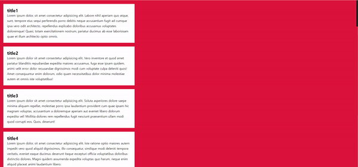
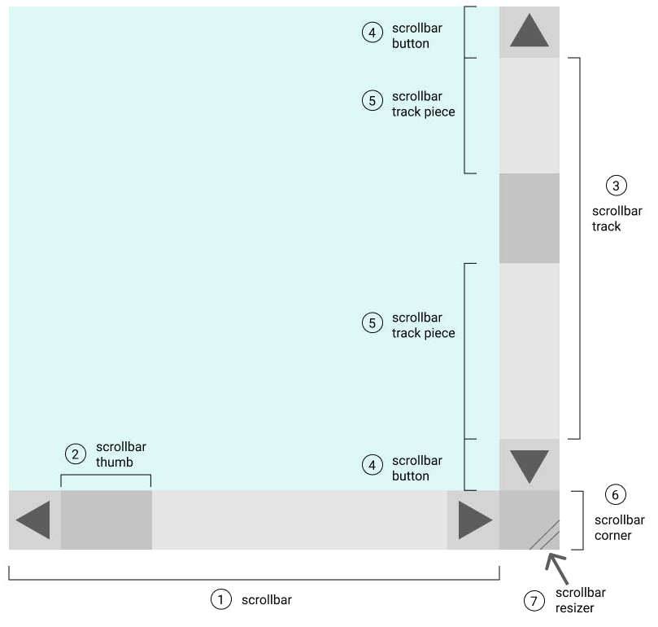

# 03.Custom Scrollbar
스크롤바를 커스텀화 

## study
### ::-webkit-scrollbar 와 ::-webkit-scrollbar-thumb 

::-webkit-scrollbar : 스크롤바 전체  
::-webkit-scrollbar-thumb : 드래그 가능한 스크롤 핸들 막대    
::-webkit-scrollbar-track : 스크롤바 트랙 (스크롤이 움직이는 영역 / 스크롤 진행률 표시줄)   
::-webkit-scrollbar-button : 스크롤바의 방향 버튼 (= 위/아래 표시 화살표)   
::-webkit-scrollbar-track-piece : 스크롤 진행률 표시줄에서 스크롤 핸들 막대 부분을 제외한 남은 빈 공간   
::-webkit-scrollbar-corner : 수평/수직 스크롤 막대가 만나는 스크롤 막대의 하단 모서리   
::-webkit-resizer : 요소의 하단 모서리에 나타나는 크기 조정 핸들

### 출처
https://developer.mozilla.org/en-US/docs/Web/CSS/::-webkit-scrollbar   
https://inpa.tistory.com/entry/CSS-%F0%9F%8C%9F-%EC%8A%A4%ED%81%AC%EB%A1%A4-%EB%B0%94Scrollbar-%EA%BE%B8%EB%AF%B8%EA%B8%B0-%EC%86%8D%EC%84%B1-%EC%B4%9D%EC%A0%95%EB%A6%AC#%EC%8A%A4%ED%81%AC%EB%A1%A4%EB%B0%94_%EA%B0%80%EC%83%81_%ED%81%B4%EB%9E%98%EC%8A%A4_%EC%84%A0%ED%83%9D%EC%9E%90_%ED%99%9C%EC%9A%A9_%EC%82%AC%EB%A1%80    
