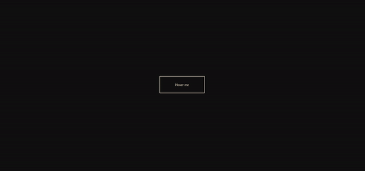
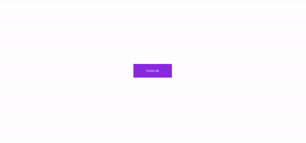
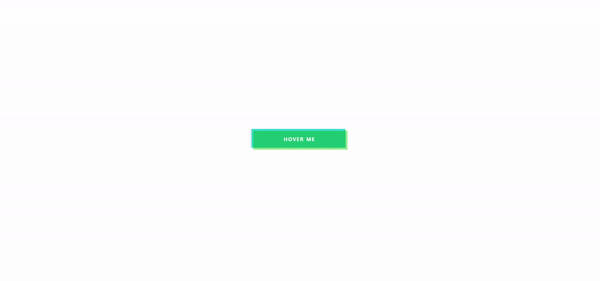
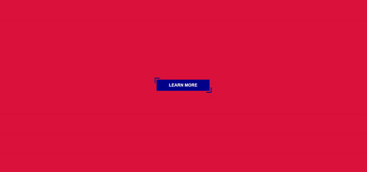

# 05. Top 5 Creative Buttons  
버튼 마우스오버 효과     

## Study 
### 1. css 가상 요소 
선택한 요소의 뒤에 붙여 표기하는 미리 약속된 키워드로, 선택한 요소의 일부분에만 스타일을 입힐 수 있음 

|가상요소|의미|
|---|---|
|::before|요소 내용 앞쪽에 새 컨텐츠를 추가|
|::after|요소 내용 끝에 새 컨텐츠를 추가|
|::selection|마우스 드래그로 선택한 텍스트 컨텐츠 영역을 선택|
|::marker|목록 아이템 앞에 붙는 마커를 선택|
|::first-letter|현재 웹 브라우저에 보이는 상태를 기준으로 요소의 텍스트 컨텐츠 첫 글자를 선택|
|::first-line|현재 웹 브라우저에 보이는 상태를 기준으로 요소의 텍스트 컨텐츠 첫 줄 내용을 선택|

## 출처 

**가상요소**   
https://apost.dev/1025/     

